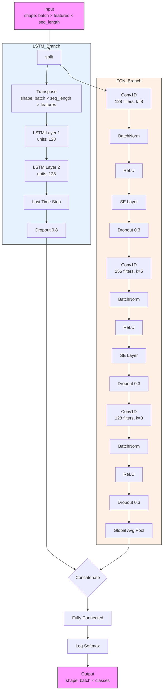

# LSTMFCN Architecture

## Architecture Details

The LSTMFCN model combines two parallel processing branches:

1. **LSTM Branch**:
   - Two-layer LSTM with 128 units
   - Takes the last time step output
   - Applies dropout (0.8)

2. **FCN Branch**:
   - Three Conv1D layers with increasing then decreasing filters
   - Each conv layer followed by BatchNorm and ReLU
   - Two Squeeze-and-Excitation (SE) layers after first two convolutions
   - Dropout (0.3) after each block
   - Global Average Pooling at the end

The outputs from both branches are concatenated and passed through a final fully connected layer with log softmax activation.
