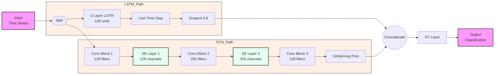

# Simplified LSTMFCN Architecture

## Key Components
1. **Dual-Path Architecture**
   - LSTM path: Sequence modeling
   - FCN path: Feature extraction with attention

2. **Conv Blocks (FCN Path)**
   - Conv1D → BatchNorm → ReLU → Dropout(0.3)
   - Filter sizes: 128 → 256 → 128

3. **SE Layers**
   - Channel attention mechanism
   - Reduction ratio = 16
   - Applied after first two conv blocks
