# LSTMFCN Architecture with SE Layer Details

```mermaid
graph TD
    subgraph Input
        input[Input Time Series<br/>batch × features × seq_length]
    end

    subgraph LSTM_Branch
        input --> transpose[Transpose<br/>batch × seq_length × features]
        transpose --> lstm1[LSTM Layer 1<br/>128 units]
        lstm1 --> lstm2[LSTM Layer 2<br/>128 units]
        lstm2 --> last_step[Last Time Step]
        last_step --> lstm_drop[Dropout 0.8]
    end

    subgraph FCN_Branch
        input --> conv1[Conv1D<br/>128 filters, k=8]
        conv1 --> bn1[BatchNorm]
        bn1 --> relu1[ReLU]

        subgraph SE_Layer_1[SE Layer 1]
            direction LR
            relu1 --> se1_pool[Global Avg Pool]
            se1_pool --> se1_fc1[FC Layer<br/>128 → 8]
            se1_fc1 --> se1_relu[ReLU]
            se1_relu --> se1_fc2[FC Layer<br/>8 → 128]
            se1_fc2 --> se1_sigmoid[Sigmoid]
            se1_sigmoid --> se1_scale[Scale Features]
        end

        se1_scale --> drop1[Dropout 0.3]
        drop1 --> conv2[Conv1D<br/>256 filters, k=5]
        conv2 --> bn2[BatchNorm]
        bn2 --> relu2[ReLU]

        subgraph SE_Layer_2[SE Layer 2]
            direction LR
            relu2 --> se2_pool[Global Avg Pool]
            se2_pool --> se2_fc1[FC Layer<br/>256 → 16]
            se2_fc1 --> se2_relu[ReLU]
            se2_relu --> se2_fc2[FC Layer<br/>16 → 256]
            se2_fc2 --> se2_sigmoid[Sigmoid]
            se2_sigmoid --> se2_scale[Scale Features]
        end

        se2_scale --> drop2[Dropout 0.3]
        drop2 --> conv3[Conv1D<br/>128 filters, k=3]
        conv3 --> bn3[BatchNorm]
        bn3 --> relu3[ReLU]
        relu3 --> drop3[Dropout 0.3]
        drop3 --> gap[Global Avg Pool]
    end

    lstm_drop --> concat{Concatenate}
    gap --> concat
    concat --> fc[Fully Connected]
    fc --> softmax[Log Softmax]
    softmax --> output[Output<br/>batch × classes]

    style input fill:#f9f,stroke:#333,stroke-width:2px
    style output fill:#f9f,stroke:#333,stroke-width:2px
    style SE_Layer_1 fill:#e6fff2,stroke:#333,stroke-width:2px
    style SE_Layer_2 fill:#e6fff2,stroke:#333,stroke-width:2px
    style LSTM_Branch fill:#e6f3ff,stroke:#333,stroke-width:2px
    style FCN_Branch fill:#fff0e6,stroke:#333,stroke-width:2px

    classDef seComponent fill:#e6fff2,stroke:#333,stroke-width:1px
    class se1_pool,se1_fc1,se1_relu,se1_fc2,se1_sigmoid,se1_scale seComponent
    class se2_pool,se2_fc1,se2_relu,se2_fc2,se2_sigmoid,se2_scale seComponent
```

## Architecture Components

1. **Input Layer**
   - Accepts time series data of shape (batch × features × seq_length)

2. **LSTM Branch**
   - Two stacked LSTM layers with 128 units each
   - Takes the last time step output
   - Applies dropout (0.8)

3. **FCN Branch with SE Layers**
   - Three Conv1D layers (128 → 256 → 128 filters)
   - Each conv layer followed by BatchNorm and ReLU
   - Two SE layers after first two convolutions
   - Dropout (0.3) after each block
   - Global Average Pooling

4. **SE (Squeeze-and-Excitation) Layer Details**
   - Global Average Pooling for channel-wise statistics
   - Two FC layers with reduction ratio=16
   - ReLU activation between FC layers
   - Sigmoid activation for scaling
   - Channel-wise multiplication for feature recalibration

5. **Output Layer**
   - Concatenation of LSTM and FCN branches
   - Fully connected layer
   - Log Softmax activation for classification
